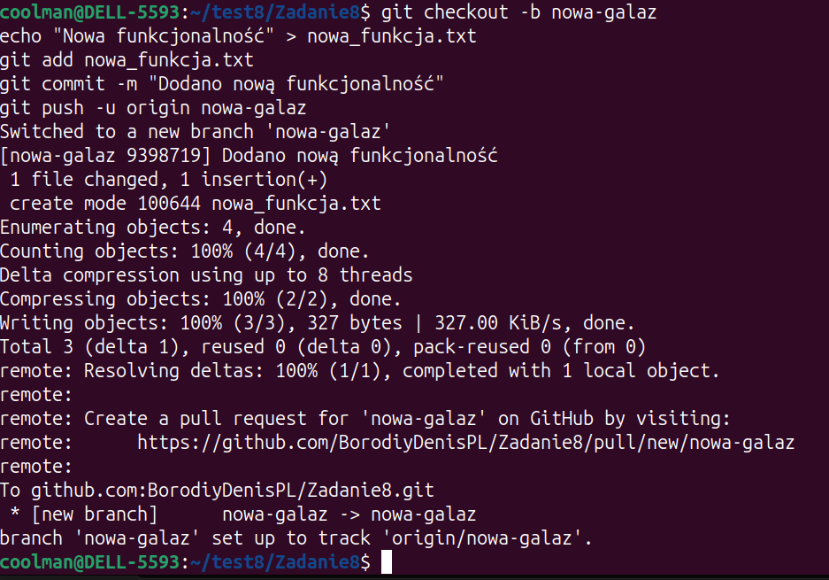
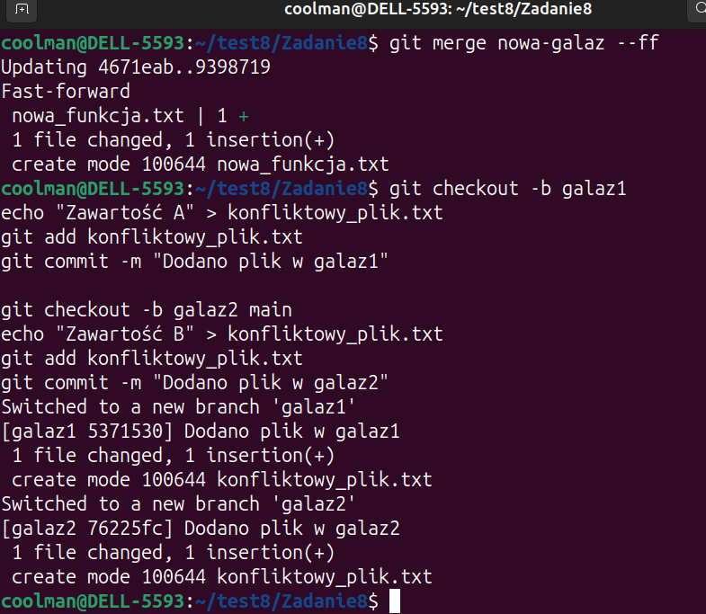

# Raport z Ćwiczenia 8

## Wyniki
-Utwórz nowe zdalne repozytorium. 
-Zrób pusha wszystkich komitów z ćwiczenia 6a/6b do zdalnego repozytorium. 
-Baw się z git remote, git fetch, git push, git pull, git branch 
-Wykonaj fast-forward merge. 
-Wykonaj 3-way merge. 
-Rozwiąż konflikt. 
-Dodaj do zdalnego repozytorium raport pokazujący wyniki Ćwiczenia 8. 
-Zaproś mnie do swojego rezpozytorium (użytkownik: Slowiczek) 

## Screenshoty:
### 1. Utwórz nowe zdalne repozytorium

### 2. Zrób pusha wszystkich komitów z ćwiczenia 6a/6b do zdalnego repozytorium.
### Baw się z git remote, git fetch, git push, git pull, git branch

### Wykonaj 3-way merge.
### Rozwiąż konflikt.

